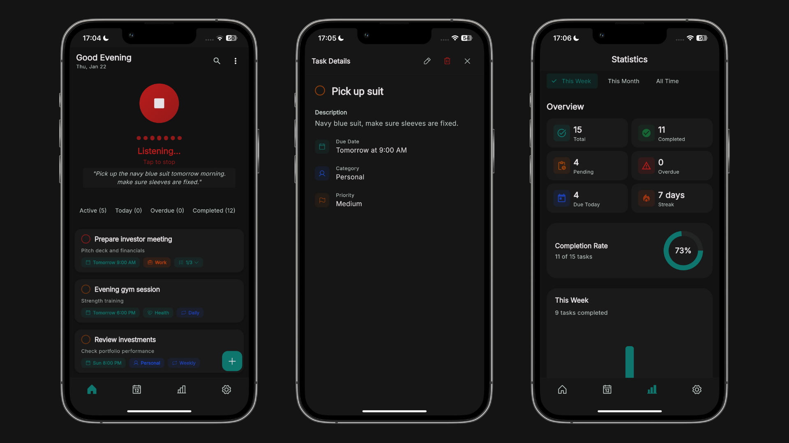

# Voxna

<p>
  
  
  
  
  
</p>

  #### A voice-powered task management app with AI-driven natural language processing, built with Clean Architecture.

<p>
  <a href="https://voxna.pages.dev">🌐 Visit</a> •
  <a href="https://github.com/shahinwahab/voxna/releases/latest/download/voxna.apk">📥 APK</a> •
  <a href="https://github.com/shahinwahab/homehelp/releases/latest/download/homehelp.exe">📥 Windows</a>
</p>

---

## App Preview

<p align="left">
    
</p>

## Features

- Voice-powered task creation with Google Gemini AI
- Smart parsing of title, due date, priority, and category from natural language
- Full CRUD operations with offline support
- Subtasks with progress tracking
- Recurring tasks (daily, weekly, monthly, yearly)
- Calendar view (month/week/day)
- Pomodoro timer with customizable intervals
- Statistics dashboard with completion trends
- Push notifications for reminders
- Export to JSON/CSV
- Dark/Light theme with custom colors
- Biometric authentication
- Home screen widget (Android)

## Architecture

Clean Architecture with BLoC pattern:

```
+-------------------------------------------------------------+
|                    Presentation Layer                       |
|           (Screens, Widgets, BLoC Controllers)              |
+-------------------------------------------------------------+
|                      Domain Layer                           |
|          (Entities, Use Cases, Repositories)                |
+-------------------------------------------------------------+
|                       Data Layer                            |
|       (Models, Data Sources, Repository Impls)              |
+-------------------------------------------------------------+
                           |
                           v
+-------------------------------------------------------------+
|                    External Services                        |
|        Supabase Auth | Supabase DB | Gemini AI              |
+-------------------------------------------------------------+
```

## Built by

**Shahin Wahab** - Software Engineer

#### <a href="https://shahinwahab.com">🌐 shahinwahab.com</a> • <a href="https://linkedin.com/in/shahinwahab">💼 LinkedIn</a>

---
> **Repository created on:** 2025-12-16, 20:16 (UTC+3)
